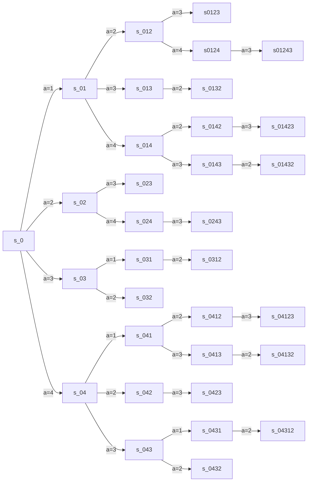

# Example

In a graph with 4/5 nodes do the gradient descend. Use the defined transition probabilities and the random policy, then compute $Q$ and $\eta$. Then compute the gradient and go on.

<!--Function that gives $Q$ and $\eta$.-->

<table>
  <tr>
    <td>
      
    </td>
    <td>
      
    </td>
  </tr>
<tr>
    <td>Figure 1. The fault has just occourred. All the substations are disconnected.</td>
    <td>Figure 2. We visit substation 4.</td>
  </tr>
</table>
<table>
  <tr>
    <td>
      
    </td>
    <td>
      
    </td>
  </tr>
<tr>
    <td>Figure 3. We have reconnected substations 4 and 5. We are in substation 3.</td>
    <td>Figure 4. We have riconnected substation 3. We are in substation 2.</td>
</tr>
</table>
<table>
  <tr><td>
    

</td></tr>
  <tr><td>Figure 5. We reconnected substations 1 and 2. All the subsations are reconnected.</td></tr>
</table>

Let's use as our example the MDP in Figures 1-5 **but pretending that substation 5 doesn't exist** (too many computations otherwise).

We estimated that the number of states is $|\mathcal S| \sim O(N \cdot N^2) = O(N^3)$, so in our case we have that $|\mathcal S| \sim N^3 = 4^3 = 64$. Instead $|\mathcal A| \sim O(N)$ so in our case $|\mathcal A| \sim 4$.

We have that the fault is $x_g = 2 - 3$ (a branch is identified by an ID or its ends).

So we have that the initial parameters are $\theta = 0$, so the policy is:
$$
\pi \Big( a \;\big|\; s = (x_g, y=(v_k, \{v\})) \Big) = \frac{e^{\theta y}}{\sum_{b \in |A|} e^{\theta y}} = \frac{e^{\theta y}}{e^{\theta y} \sum_{b \in \{v\}} 1 } = \frac1{ |\{v\}| } \, .
\nonumber
$$
The equations are:
$$
Q_\pi\Big( s = (x_g,v_k,\{v\}), a \Big) = d_{v_k, a} \cdot n_{k+1} + \sum_{a' \in \{v'\}}  \frac1{|\{v'\}|} Q \Big( \sigma(s,a), a' \Big)
\nonumber
$$

$$
\eta_\pi \Big(s'=(x_g, v_{k+1}, \{v'\}) \Big) = \frac1{N^2} \mathbb I \big(\{v'\} = \mathcal C \big) + \sum_s \frac1{|\{v\}|} \eta_\pi \Big( s = (x_g, v_{k}, \{v\}) \Big)
\nonumber
$$

Let's suppose we have this time matrix (in seconds) for the values of $d_{v_k,v_{k+1}}$ (for now it is symmetric, but it can also not be symmetric, for example if there are one way streets or if we consider traffic):
$$
&   0 &   1 &   2 &   3 &   4  \\
0 &   0 & 213 & 514 & 421 & 346 \\
1 & 213 &   0 & 633 & 426 & 212 \\
2 & 514 & 633 &   0 & 359 & 568 \\
3 & 421 & 426 & 359 &   0 & 614 \\
4 & 346 & 212 & 568 & 614 &   0 \\
\nonumber
$$
and these values for the number of users under each substation:
$$
\begin{matrix}
u_1 & u_2 & u_3 & u_4 \\
102 & 45 & 256 & 168
\end{matrix}
\nonumber
$$
The initial state is $s_0 = (x_g, 0, \mathcal C = \{1,2,3,4\})$. So we have that $\pi (a | s_0) = \frac1{|\{1,2,3,4\}|} = \frac14$. So we have $4$ possible actions: $a \in \{1,2,3,4\}$.

**NB:** Let's name the states with $s_{abc\ldots}$ where the letters denotes the sequence of visited substations

- if $a=1$, we can reconnect only substation $1$, so the next state is $s_{01} = (x_g, 1, \{2,3,4\})$, thus $n_1 = \sum_{v \in \{2,3,4\} } u_v = 45+256+168 = 469$ and we have that
  $$
  \begin{aligned}
  Q_\pi(s_0, 1) &= d_{0, 1} \cdot n_{1} + \sum_{a' \in \{2,3,4\}}  \frac13 Q \Big( s_{01}, a' \Big) \\
  &= 213 \cdot 469 + \frac13 Q(s_{01}, 2) + \frac13 Q(s_{01}, 3) + \frac13 Q(s_{01}, 4)
  \end{aligned}
  \nonumber
  $$
  $$
  Q_\pi(s_0, 1) - \frac13 Q(s_{01}, 2) - \frac13 Q(s_{01}, 3) - \frac13 Q(s_{01}, 4) = 99897
  \label{eq:1}
  $$

  From here we have these possible actions:

  - if $a = 2$, we can reconnect only substation $2$, so the next state is $s_{012} = (x_g, 2, \{3,4\})$, thus $n_{12} = \sum_{v \in \{3,4\} } u_v = 256+168 = 424$ and we have that
    $$
    \begin{aligned}
    Q_\pi(s_{01}, 2) &= d_{1, 2} \cdot n_{12} + \sum_{a' \in \{3,4\}}  \frac12 Q \Big( s_{012}, a' \Big) \\
    &= 633 \cdot 424 + \frac12 Q(s_{012}, 3) + \frac12 Q(s_{012}, 4)
    \end{aligned}
    \nonumber
    $$
    $$
    Q_\pi(s_{01}, 2) - \frac12 Q(s_{012}, 3) - \frac12 Q(s_{012}, 4) = 268392
    \label{eq:2}
    $$

    From here we have these possible actions:

    - if $a = 3$, we can reconnect substations $3$ and $4$, so the next state is $s_{0123} = (x_g, 3, \varnothing)$, thus $n_{123} = 0$ and we have that
      $$
      Q(s_{012},3) = d_{2,3} \cdot n_{123} = 359 \cdot 0 = 0
      \label{eq:3}
      $$

    - if $a=4$, we can reconnect only substation $4$, so the next state is $s_{0124} = (x_g, 4, \{3\})$, thus $n_{124} = \sum_{v \in \{3\} } u_v = 256$ and we have that
      $$
      \begin{aligned}
      Q_\pi(s_{012}, 4) &= d_{2, 4} \cdot n_{124} + \sum_{a' \in \{3\}} 1 \cdot Q \Big( s_{0124}, a' \Big) \\
      &= 568 \cdot 256 + Q(s_{0124}, 3)
      \end{aligned}
      \nonumber
      $$

      $$
      Q_\pi(s_{012}, 4) - Q(s_{0124}, 3) = 145408
      \label{eq:4}
      $$

      - then $a = 3$ and we reconnect all the substations, so the next state is $s_{01243} = (x_g, 3, \varnothing)$, thus $n_{1243} = 0$ and we have that
        $$
        Q(s_{0124}, 3) = d_{4,3} \cdot n_{1243} = 614 \cdot 0 = 0
        \label{eq:5}
        $$

  - if $a=3$, we can reconnect substations $3$ and $4$, so the next state is $s_{013} = (x_g, 3, \{2\})$, thus $n_{13} = \sum_{v \in \{2\} } u_v = 45$ and we have that
    $$
    \begin{aligned}
    Q_\pi(s_{01}, 3) &= d_{1, 3} \cdot n_{13} + \sum_{a' \in \{2\}} 1 \cdot Q \Big( s_{013}, a' \Big) \\
    &= 426 \cdot 45 + Q(s_{013}, 2)
    \end{aligned}
    \nonumber
    $$

    $$
    Q_\pi(s_{01}, 3) - Q(s_{013}, 2) = 19170
    \label{eq:6}
    $$

    - then $a = 2$ and we reconnect all the substations, so the next state is $s_{0132} = (x_g, 2, \varnothing)$, thus $n_{132} = 0$ and we have that

    $$
    Q(s_{013}, 2) = d_{3,2} \cdot n_{132} = 359 \cdot 0 = 0
    \label{eq:7}
    $$

  - if $a=4$, we can reconnect only substation $4$, so the next state is $s_{014} = (x_g, 4, \{2,3\})$, thus $n_{14} = \sum_{v \in \{2,3\} } u_v = 45 + 256 = 301$ and we have that
    $$
    \begin{aligned}
    Q_\pi(s_{01}, 4) &= d_{1, 4} \cdot n_{14} + \sum_{a' \in \{2,3\}} \frac12 \cdot Q \Big( s_{014}, a' \Big) \\
    &= 212 \cdot 301 + \frac12 Q(s_{014}, 2) + \frac12 Q(s_{014}, 3)
    \end{aligned}
    \nonumber
    $$
    $$
    Q_\pi(s_{01}, 4) - \frac12 Q(s_{014}, 2) - \frac12 Q(s_{014}, 3) = 63812
    \label{eq:8}
    $$

    From here we have these possible actions:

    - if $a = 2$, we can reconnect only substation $2$, so the next state is $s_{0142} = (x_g, 2, \{3\})$, thus $n_{142} = \sum_{v \in \{3\} } u_v = 256$ and we have that
      $$
      \begin{aligned}
      Q_\pi(s_{014}, 2) &= d_{4, 2} \cdot n_{142} + \sum_{a' \in \{3\}} 1 \cdot Q \Big( s_{0142}, a' \Big) \\
      &= 568 \cdot 256 + Q(s_{0142}, 3)
      \end{aligned}
      \nonumber
      $$

      $$
      Q_\pi(s_{014}, 2) - Q(s_{0142}, 3) = 145408
      \label{eq:9}
      $$

      - then $a = 3$ and we reconnect all the substations, so the next state is $s_{01423} = (x_g, 3, \varnothing)$, thus $n_{1423} = 0$ and we have that
        $$
        Q(s_{0142}, 3) = d_{2,3} \cdot n_{1423} = 359 \cdot 0 = 0
        \label{eq:10}
        $$

    - if $a=3$, we can reconnect only substation $3$, so the next state is $s_{0143} = (x_g, 3, \{2\})$, thus $n_{143} = \sum_{v \in \{2\} } u_v = 45$ and we have that
      $$
      \begin{aligned}
      Q_\pi(s_{014}, 3) &= d_{4, 3} \cdot n_{143} + \sum_{a' \in \{2\}} 1 \cdot Q \Big( s_{0143}, a' \Big) \\
      &= 614 \cdot 45 + Q(s_{0143}, 2)
      \end{aligned}
      \nonumber
      $$

      $$
      Q_\pi(s_{014}, 3) - Q(s_{0143}, 2) = 27630
      \label{eq:11}
      $$

      - then $a = 2$ and we reconnect all the substations, so the next state is $s_{01432} = (x_g, 2, \varnothing)$, thus $n_{1432} = 0$ and we have that
        $$
        Q(s_{0143}, 2) = d_{3,2} \cdot n_{1432} = 359 \cdot 0 = 0
        \label{eq:12}
        $$

- if $a = 2$, we can reconnect substations $1$ and $2$, so the next state is $s_{02} = (x_g, 2, \{3, 4\})$, thus $n_2 = \sum_{v \in \{3,4\}} u_v = 256 + 168 = 424$ and we have that
  $$
  \begin{aligned}
  Q_\pi(s_0, 2) &= d_{0,2} \cdot n_{2} + \sum_{a' \in \{3,4\}}  \frac12 Q \Big( s_{02}, a' \Big) \\
  &= 514 \cdot 424 + \frac12 Q(s_{02}, 3) + \frac12 Q(s_{02}, 4) 
  \end{aligned}
  \nonumber
  $$
  $$
  Q_\pi(s_0, 2) - \frac12 Q(s_{02}, 3) - \frac12 Q(s_{02}, 4) = 217936
  \label{eq:13}
  $$

  From here we have these possible actions:

  - if $a=3$, we can reconnect substations $3$ and $4$, so the next state is $s_{023} = (x_g, 3, \varnothing)$, thus $n_{23} =0$ and we have that
    $$
    Q(s_{02}, 3) = d_{2,3} \cdot n_{23} = 359 \cdot 0 = 0
    \label{eq:14}
    $$

  - if $a=4$, we can reconnect only substation $4$, so the next state is $s_{024} = (x_g, 4, \{3\})$, thus $n_{24} = \sum_{v \in \{3\} } u_v = 256$ and we have that
    $$
    \begin{aligned}
    Q_\pi(s_{02}, 4) &= d_{2,4} \cdot n_{2} + \sum_{a' \in \{3\}}  1 \cdot Q \Big( s_{024}, a' \Big) \\
    &= 568 \cdot 256 + Q(s_{024}, 3)
    \end{aligned}
    \nonumber
    $$

    $$
    Q_\pi(s_{02}, 4) - Q(s_{024}, 3) = 145408
    \label{eq:15}
    $$

    - then $a = 3$ and we reconnect all the substations, so the next state is $s_{0243} = (x_g, 3, \varnothing)$, thus $n_{243} = 0$ and we have that
      $$
      Q(s_{024}, 3) = d_{4,3} \cdot n_{243} = 614 \cdot 0 = 0
      \label{eq:16}
      $$

- if $a=3$, we can reconnect substations $3$ and $4$, so the next state is $s_{03} = (x_g, 3, \{1, 2\})$, thus $n_3 = \sum_{v \in \{1,2\}} u_v = 102 + 45 = 147$ and we have that
  $$
  \begin{aligned}
  Q_\pi(s_0, 3) &= d_{0,3} \cdot n_{3} + \sum_{a' \in \{1,2\}}  \frac12 Q \Big( s_{03}, a' \Big) \\
  &= 421 \cdot 147 + \frac12 Q(s_{03}, 1) + \frac12 Q(s_{03}, 2)
  \end{aligned}
  \nonumber
  $$
  $$
  Q_\pi(s_0, 3) - \frac12 Q(s_{03}, 1) - \frac12 Q(s_{03}, 2) = 61887
  \label{eq:17}
  $$

  From here we have these possible actions:

  - if $a=1$, we can reconnect only substation $1$, so the next state is $s_{031} = (x_g, 1, \{2\})$, thus $n_{31} = \sum_{v \in \{2\} } u_v = 45$ and we have that
    $$
    \begin{aligned}
    Q_\pi(s_{03}, 1) &= d_{3,1} \cdot n_{31} + \sum_{a' \in \{2\}}  1 \cdot Q \Big( s_{031}, a' \Big) \\
    &= 426 \cdot 45 + Q(s_{031}, 2)
    \end{aligned}
    \nonumber
    $$

    $$
    Q_\pi(s_{03}, 1) - Q_\pi (s_{031},2) = 19170
    \label{eq:18}
    $$

    - then $a = 2$ and we reconnect all the substations, so the next state is $s_{0312} = (x_g, 2, \varnothing)$, thus $n_{312} = 0$ and we have that
      $$
      Q(s_{031}, 2) = d_{1,2} \cdot n_{132} = 633 \cdot 0 = 0
      \label{eq:19}
      $$

  - if $a=2$​, we can reconnect substations $1$ and $2$, so the next state is $s_{032} = (x_g, 2, \varnothing)$, thus $n_{32} =0$ and we have that
    $$
    Q(s_{03}, 2) = d_{3,2} \cdot n_{32} = 359 \cdot 0 = 0
    \label{eq:20}
    $$

- if $a=4$, we can reconnect only substation $4$, so the next state is $s_{04} = (x_g, 4, \{1, 2, 3\})$, thus $n_4 = \sum_{v \in \{1,2\}} u_v = 102 + 45 + 256 = 403$ and we have that
  $$
  \begin{aligned}
  Q_\pi(s_0, 4) &= d_{0,4} \cdot n_{4} + \sum_{a' \in \{1,2,3\}}  \frac13 Q \Big( s_{04}, a' \Big) \\
  &= 346 \cdot 403 + \frac13 Q(s_{04}, 1) + \frac13 Q(s_{04}, 2) + \frac13 Q(s_{04}, 3)
  \end{aligned}
  \nonumber
  $$
  $$
  Q_\pi(s_0, 4) - \frac13 Q(s_{04}, 1) - \frac13 Q(s_{04}, 2) - \frac13 Q(s_{04}, 3) = 139438
  $$

  From here we have these possible actions:

  - if $a=1$, we can reconnect only substation $1$, so the next state is $s_{041} = (x_g, 1, \{2,3\})$, thus $n_{41} = \sum_{v \in \{2,3\} } u_v = 45 + 256 = 301$ and we have that
    $$
    \begin{aligned}
    Q_\pi(s_{04}, 1) &= d_{4,1} \cdot n_{41} + \sum_{a' \in \{2,3\}}  \frac12 Q \Big( s_{041}, a' \Big) \\
    &= 212 \cdot 301 + \frac12 Q(s_{041}, 2) + \frac12 Q(s_{041}, 3)
    \end{aligned}
    \nonumber
    $$

    $$
    Q_\pi(s_{04}, 1) - \frac12 Q(s_{041}, 2) - \frac12 Q(s_{041}, 3) = 63812
    $$

    From here we have these possible actions:

    - if $a=2$, we can reconnect only substation $2$, so the next state is $s_{0412} = (x_g, 2, \{3\})$, thus $n_{412} = \sum_{v \in \{3\} } u_v = 256 = 301$ and we have that
      $$
      \begin{aligned}
      Q_\pi(s_{041}, 2) &= d_{1,2} \cdot n_{412} + \sum_{a' \in \{3\}}  1 \cdot Q \Big( s_{0412}, a' \Big) \\
      &= 633 \cdot 256 + Q(s_{0412}, 3)
      \end{aligned}
      \nonumber
      $$

      $$
      Q_\pi(s_{041}, 2) - Q(s_{0412}, 3) = 162048
      $$

      - then $a = 3$ and we reconnect all the substations, so the next state is $s_{04123} = (x_g, 3, \varnothing)$, thus $n_{4123} = 0$ and we have that
        $$
        Q(s_{0412},3) = d_{2,3} \cdot n_{4123} = 359 \cdot 0 = 0
        $$

    - if $a=3$, we can reconnect only substation $3$, so the next state is $s_{0413} = (x_g, 3, \{2\})$, thus $n_{413} = \sum_{v \in \{2\} } u_v = 45$ and we have that
      $$
      \begin{aligned}
      Q_\pi(s_{041}, 3) &= d_{1,3} \cdot n_{413} + \sum_{a' \in \{2\}}  1 \cdot Q \Big( s_{0413}, a' \Big) \\
      &= 426 \cdot 45 + Q(s_{0413}, 2)
      \end{aligned}
      \nonumber
      $$

      $$
      Q_\pi(s_{041}, 3) - Q(s_{0413}, 2) = 19170
      $$

      - then $a = 2$ and we reconnect all the substations, so the next state is $s_{04132} = (x_g, 2, \varnothing)$, thus $n_{4132} = 0$ and we have that

      $$
      Q(s_{0413},2) = d_{3,2} \cdot n_{4132} = 359 \cdot 0 = 0
      $$

  - if $a=2$, we can reconnect substations $1$ and $2$, so the next state is $s_{042} = (x_g, 2, \{3\})$, thus $n_{42} = \sum_{v \in \{3\}} u_v = 256$ and we have that
    $$
    \begin{aligned}
    Q_\pi(s_{04}, 2) &= d_{4,2} \cdot n_{42} + \sum_{a' \in \{3\}}  1 \cdot Q \Big( s_{042}, a' \Big) \\
    &= 568 \cdot 256 + Q(s_{042}, 3)
    \end{aligned}
    \nonumber
    $$

    $$
    Q_\pi(s_{04}, 2) - Q(s_{042}, 3) = 145408
    $$

    - then $a = 3$ and we reconnect all the substations, so the next state is $s_{0423} = (x_g, 3, \varnothing)$, thus $n_{423} = 0$ and we have that
      $$
      Q(s_{042},3) = d_{2,3} \cdot n_{423} = 359 \cdot 0 = 0
      $$

  - if $a=3$, we can reconnect only substation $3$, so the next state is $s_{043} = (x_g, 3, \{1,2\})$, thus $n_{43} = \sum_{v \in \{1,2\}} u_v = 102 + 45 = 147$ and we have that
    $$
    \begin{aligned}
    Q_\pi(s_{04}, 3) &= d_{4,3} \cdot n_{43} + \sum_{a' \in \{1,2\}} \frac12 Q \Big( s_{043}, a' \Big) \\
    &= 614 \cdot 147 + \frac12 Q(s_{043}, 1) + \frac12 Q(s_{043}, 2)
    \end{aligned}
    \nonumber
    $$

    $$
    Q_\pi(s_{04}, 3) - \frac12 Q(s_{043}, 1) - \frac12 Q(s_{043}, 2) = 90258
    $$

    From here we have these possible actions:

    - if $a=1$, we can reconnect only substation $1$, so the next state is $s_{0431} = (x_g, 1, \{2\})$, thus $n_{431} = \sum_{v \in \{2\}} u_v = 45$ and we have that
      $$
      \begin{aligned}
      Q_\pi(s_{043}, 1) &= d_{3,1} \cdot n_{431} + \sum_{a' \in \{2\}}  1 \cdot Q \Big( s_{0431}, a' \Big) \\
      &= 426 \cdot 45 + Q(s_{0431}, 2)
      \end{aligned}
      \nonumber
      $$

      $$
      Q_\pi(s_{043}, 1) - Q(s_{0431}, 2) = 19170
      $$

      - then $a = 2$ and we reconnect all the substations, so the next state is $s_{04312} = (x_g, 2, \varnothing)$, thus $n_{4312} = 0$ and we have that

      $$
      Q(s_{0431},2) = d_{1,2} \cdot n_{4312} = 633 \cdot 0 = 0
      $$

    - if $a=2$, we can reconnect substations $1$ and $2$, so the next state is $s_{0432} = (x_g, 2, \varnothing)$, thus $n_{432} = 0$ and we have that
      $$
      Q(s_{043}, 2) = d_{3,2} \cdot n_{432} = 359 \cdot 0 = 0
      $$
      

#### States schema

There are $33$ states, instead of the $64$ we estimated. The terminal states are $s = (x_g, v_k, \varnothing)$, but we have that $v_k$ must be one of the two substations near the fault, or the substation in which we have the fault. So there are at most two terminal states. In this example, they are $s_{t_1} = (x_g, 2, \varnothing)$ and $s_{t_2} = (x_g, 3, \varnothing)$. Besides, there are some states that are equal, so they are actually less than 33.

#### $Q$-table

|                                  | $a=1$                                     | $a=2$                                     | $a=3$                                 | $a=4$                                      |
| -------------------------------- | ----------------------------------------- | ----------------------------------------- | ------------------------------------- | ------------------------------------------ |
| $s_0 = (x_g, 0, \{1,2,3,4\})$    | $Q(s_0, 1) = 270096, \eqref{eq:1}$        | $Q(s_0,2) = 290640, \eqref{eq:13}$        | $Q(s_0,3) = 71472, \eqref{eq:17}$     | $Q(s_0,4)$                                 |
| $s_{01} = (x_g, 1, \{2,3,4\})$   |                                           | $Q_\pi(s_{01}, 2) = 341096, \eqref{eq:2}$ | $Q(s_{01},3) = 19170, \eqref{eq:6}$   | $Q(s_{01},4) = 150331, \eqref{eq:8}$       |
| $s_{012} = (x_g, 2, \{3,4\})$    |                                           |                                           | $Q(s_{012},3) = 0, \eqref{eq:3}$      | $Q(s_{012},4) = 145408, \eqref{eq:4}$      |
| $s_{0124} = (x_g, 4, \{3\})$     |                                           |                                           | $Q(s_{0124},3) = 0, \eqref{eq:5}$     |                                            |
| $s_{013} = (x_g, 3, \{2\})$      |                                           | $Q(s_{013}, 2) = 0, \eqref{eq:7}$         |                                       |                                            |
| $s_{014} = (x_g, 4, \{2,3\})$    |                                           | $Q(s_{014},2) = 145408, \eqref{eq:9}$     | $Q(s_{014},3) = 27630, \eqref{eq:11}$ |                                            |
| $s_{0142} = (x_g, 2, \{3\})$     |                                           |                                           | $Q(s_{0142}, 3) = 0, \eqref{eq:10}$   |                                            |
| $s_{02} = (x_g, 2, \{3, 4\})$    |                                           |                                           | $Q(s_{02}, 3) = 0, \eqref{eq:14}$     | $Q_\pi(s_{02}, 4) = 145408, \eqref{eq:15}$ |
| $s_{024} = (x_g, 4, \{3\})$      |                                           |                                           | $Q(s_{024}, 3) = 0, \eqref{eq:16}$    |                                            |
| $s_{03} = (x_g, 3, \{1, 2\})$    | $Q_\pi(s_{03}, 1) = 19170, \eqref{eq:18}$ | $Q(s_{03}, 2) = 0, \eqref{eq:20}$         |                                       |                                            |
| $s_{031} = (x_g, 1, \{2\})$      |                                           | $Q(s_{031}, 2) = 0, \eqref{eq:19}$        |                                       |                                            |
| $s_{04} = (x_g, 4, \{1, 2, 3\})$ |                                           |                                           |                                       |                                            |
| $s_{041} = (x_g, 1, \{2,3\})$    |                                           |                                           |                                       |                                            |

