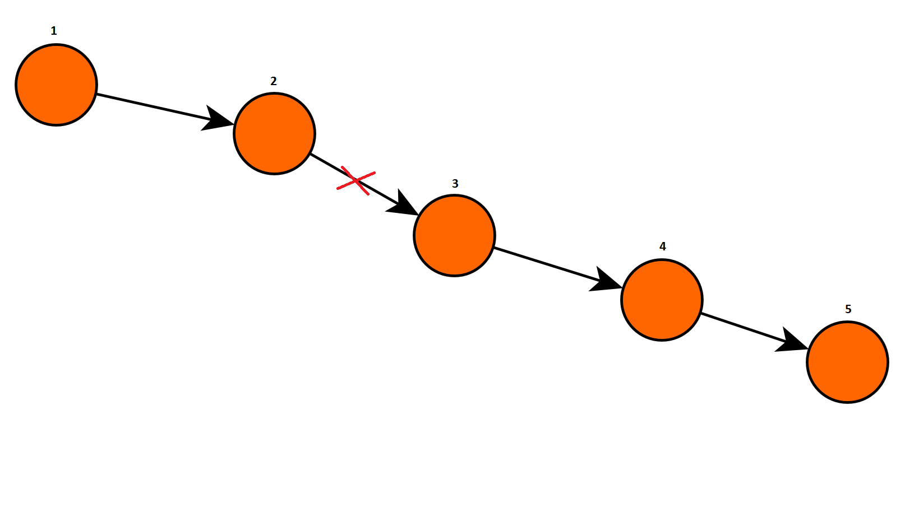
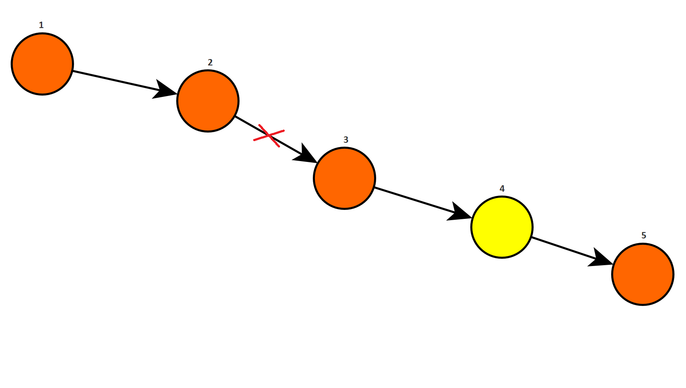
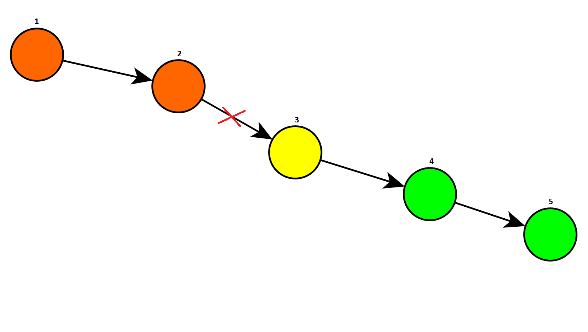
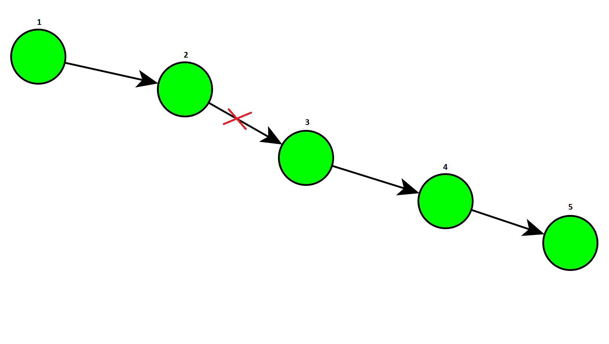

# Example


In a graph with 4/5 nodes do the gradient descend. Use the defined transition probabilities and the random policy, then compute $Q$ and $\eta$. Then compute the gradient and go on.

<!--Function that gives $Q$ and $\eta$.-->


<table>
  <tr>
    <td>
      
    </td>
    <td>
      
    </td>
  </tr>
<tr>
    <td>Figure 1. The fault has just occourred. All the substations are disconnected.</td>
    <td>Figure 2. We visit substation 4.</td>
  </tr>
</table>
<table>
  <tr>
    <td>
      
    </td>
    <td>
      
    </td>
  </tr>
<tr>
    <td>Figure 3. We have reconnected substations 4 and 5. We are in substation 3.</td>
    <td>Figure 4. We have riconnected substation 3. We are in substation 2.</td>
</tr>
</table>
<table>
  <tr><td>
    <p style="text-align:center;"></p></td></tr>
  <tr><td>Figure 5. We reconnected substations 1 and 2. All the subsations are reconnected.</td></tr>
</table>


Let's use as our example the MDP in Figures 1-5 **but pretending that substation 5 doesn't exist** (too many computations otherwise). So we have that $N=4$.

We estimated that the number of states is $|\mathcal S| \sim O(N \cdot N^2) = O(N^3)$, so in our case we have that $|\mathcal S| \sim N^3 = 4^3 = 64$. Instead $|\mathcal A| \sim O(N)$ so in our case $|\mathcal A| \sim 4$.

We have that the fault is $x_g = 2 - 3$ (a branch is identified by an ID or its ends).

So we have that the initial parameters are $\theta = 0$, so the policy is:
$$
\pi \Big( a \;\big|\; s = (x_g, y=(v_k, \{v\})) \Big) = \frac{e^{\theta}}{\sum_{b \in \{v\}} e^{\theta}} = \frac{e^{\theta}}{e^{\theta} \sum_{b \in \{v\}} 1 } = \frac1{ |\{v\}| } \, .
\nonumber
$$
The equations are:
$$
Q_\pi\Big( s = (x_g,v_k,\{v\}), a \Big) = d_{v_k, a} \cdot n_{k+1} + \sum_{a' \in \{v'\}}  \frac1{|\{v'\}|} Q \Big( \sigma(s,a), a' \Big)
\nonumber
$$

$$
\eta_\pi \Big(s'=(x_g, v_{k+1}, \{v'\}) \Big) = \frac1{2N+1} \mathbb I \big( v_k = 0, \{v'\} = \mathcal C \big) + \sum_s \frac1{|\{v\}|} \eta_\pi \Big( s = (x_g, v_{k}, \{v\}) \Big)
\nonumber
$$

Let's suppose we have this time matrix (in seconds) for the values of $d_{v_k,v_{k+1}}$ (for now it is symmetric, but it can also not be symmetric, for example if there are one way streets or if we consider traffic):
$$
&   0 &   1 &   2 &   3 &   4  \\
0 &   0 & 213 & 514 & 421 & 346 \\
1 & 213 &   0 & 633 & 426 & 212 \\
2 & 514 & 633 &   0 & 359 & 568 \\
3 & 421 & 426 & 359 &   0 & 614 \\
4 & 346 & 212 & 568 & 614 &   0 \\
\nonumber
$$
and these values for the number of users under each substation:
$$
\begin{matrix}
u_1 & u_2 & u_3 & u_4 \\
102 & 45 & 256 & 168
\end{matrix}
\nonumber
$$
### Computation of $Q$

The initial state is $s_0 = (x_g, 0, \mathcal C = \{1,2,3,4\})$. We have $4$ possible actions: $a \in \{1,2,3,4\}$ and we have that $\pi (a | s_0) = \frac1{|\{1,2,3,4\}|} = \frac14$.

**NB:** Let's name the states with $s_{abc\ldots}$ where the letters denotes the sequence of visited substations

- if $a=1$, we can reconnect only substation $1$, so the next state is $s_{01} = (x_g, 1, \{2,3,4\})$, thus $n_0 = \sum_{v \in \mathcal C} u_v = \sum_{v \in \{1,2,3,4\} } u_v = 102+45+256+168 = 571$ and we have that
  $$
  \begin{aligned}
  Q_\pi(s_0, 1) &= d_{0, 1} \cdot n_{0} + \sum_{a' \in \{2,3,4\}}  \frac13 Q \Big( s_{01}, a' \Big) \\
  &= 213 \cdot 571 + \frac13 Q(s_{01}, 2) + \frac13 Q(s_{01}, 3) + \frac13 Q(s_{01}, 4)
  \end{aligned}
  \nonumber
  $$
  $$
  Q_\pi(s_0, 1) - \frac13 Q(s_{01}, 2) - \frac13 Q(s_{01}, 3) - \frac13 Q(s_{01}, 4) = 121623
  \label{eq:1}\tag{1.1}
  $$

  From here we have these possible actions:

  - if $a = 2$, we can reconnect only substation $2$, so the next state is $s_{012} = (x_g, 2, \{3,4\})$, thus $n_{01} = \sum_{v \in \{2,3,4\} } u_v = 45+256+168 = 469$ and we have that
    $$
    \begin{aligned}
    Q_\pi(s_{01}, 2) &= d_{1, 2} \cdot n_{01} + \sum_{a' \in \{3,4\}}  \frac12 Q \Big( s_{012}, a' \Big) \\
    &= 633 \cdot 469 + \frac12 Q(s_{012}, 3) + \frac12 Q(s_{012}, 4)
    \end{aligned}
    \nonumber
    $$
    $$
    Q_\pi(s_{01}, 2) - \frac12 Q(s_{012}, 3) - \frac12 Q(s_{012}, 4) = 296877
    \label{eq:2}\tag{1.2}
    $$

    From here we have these possible actions:

    - if $a = 3$, we can reconnect substations $3$ and $4$, so the next state is $s_{0123} = (x_g, 3, \varnothing)$, thus $n_{012} = \sum_{v \in \{3,4\}} = 256+168 = 424$ and we have that
      $$
      Q(s_{012},3) = d_{2,3} \cdot n_{012} = 359 \cdot 424 = 152216
      \label{eq:3}\tag{1.3}
      $$

    - if $a=4$, we can reconnect only substation $4$, so the next state is $s_{0124} = (x_g, 4, \{3\})$, thus $n_{012} = \sum_{v \in \{3,4\} } u_v = 256+168=424$ and we have that
      $$
      \begin{aligned}
      Q_\pi(s_{012}, 4) &= d_{2, 4} \cdot n_{012} + \sum_{a' \in \{3\}} 1 \cdot Q \Big( s_{0124}, a' \Big) \\
      &= 568 \cdot 424 + Q(s_{0124}, 3)
      \end{aligned}
      \nonumber
      $$

      $$
      Q_\pi(s_{012}, 4) - Q(s_{0124}, 3) = 240832
      \label{eq:4}\tag{1.4}
      $$

      - then $a = 3$ and we reconnect all the substations, so the next state is $s_{01243} = (x_g, 3, \varnothing)$, thus $n_{0124} = \sum_{v \in \{3\}} u_v = 256$ and we have that
        $$
        Q(s_{0124}, 3) = d_{4,3} \cdot n_{0124} = 614 \cdot 256 = 157184
        \label{eq:5}\tag{1.5}
        $$

  - if $a=3$, we can reconnect substations $3$ and $4$, so the next state is $s_{013} = (x_g, 3, \{2\})$, thus $n_{01} = \sum_{v \in \{2,3,4\} } u_v = 45+256+168 = 469$ and we have that
    $$
    \begin{aligned}
    Q_\pi(s_{01}, 3) &= d_{1, 3} \cdot n_{01} + \sum_{a' \in \{2\}} 1 \cdot Q \Big( s_{013}, a' \Big) \\
    &= 426 \cdot 469 + Q(s_{013}, 2)
    \end{aligned}
    \nonumber
    $$

    $$
    Q_\pi(s_{01}, 3) - Q(s_{013}, 2) = 199794
    \label{eq:6}\tag{1.6}
    $$

    - then $a = 2$ and we reconnect all the substations, so the next state is $s_{0132} = (x_g, 2, \varnothing)$, thus $n_{013} = \sum_{v \in \{2\}} u_v = 45$ and we have that

    $$
    Q(s_{013}, 2) = d_{3,2} \cdot n_{013} = 359 \cdot 45 = 16155
    \label{eq:7}\tag{1.7}
    $$

  - if $a=4$, we can reconnect only substation $4$, so the next state is $s_{014} = (x_g, 4, \{2,3\})$, and since $n_{01} = 469$ and we have that
    $$
    \begin{aligned}
    Q_\pi(s_{01}, 4) &= d_{1, 4} \cdot n_{01} + \sum_{a' \in \{2,3\}} \frac12 \cdot Q \Big( s_{014}, a' \Big) \\
    &= 212 \cdot 469 + \frac12 Q(s_{014}, 2) + \frac12 Q(s_{014}, 3)
    \end{aligned}
    \nonumber
    $$
    $$
    Q_\pi(s_{01}, 4) - \frac12 Q(s_{014}, 2) - \frac12 Q(s_{014}, 3) = 99428
    \label{eq:8}\tag{1.8}
    $$

    From here we have these possible actions:

    - if $a = 2$, we can reconnect only substation $2$, so the next state is $s_{0142} = (x_g, 2, \{3\})$, thus $n_{014} = \sum_{v \in \{2,3\} } u_v = 45+256=301$ and we have that
      $$
      \begin{aligned}
      Q_\pi(s_{014}, 2) &= d_{4, 2} \cdot n_{014} + \sum_{a' \in \{3\}} 1 \cdot Q \Big( s_{0142}, a' \Big) \\
      &= 568 \cdot 301 + Q(s_{0142}, 3)
      \end{aligned}
      \nonumber
      $$

      $$
      Q_\pi(s_{014}, 2) - Q(s_{0142}, 3) = 170968
      \label{eq:9}\tag{1.9}
      $$

      - then $a = 3$ and we reconnect all the substations, so the next state is $s_{01423} = (x_g, 3, \varnothing)$, thus $n_{0142} = u_3 = 256$ and we have that
        $$
        Q(s_{0142}, 3) = d_{2,3} \cdot n_{0142} = 359 \cdot 256 = 91904
        \label{eq:10}\tag{1.10}
        $$

    - if $a=3$, we can reconnect only substation $3$, so the next state is $s_{0143} = (x_g, 3, \{2\})$, thus $n_{014} = \sum_{v \in \{2,3\} } u_v = 45 + 256 = 301$ and we have that
      $$
      \begin{aligned}
      Q_\pi(s_{014}, 3) &= d_{4, 3} \cdot n_{014} + \sum_{a' \in \{2\}} 1 \cdot Q \Big( s_{0143}, a' \Big) \\
      &= 614 \cdot 301 + Q(s_{0143}, 2)
      \end{aligned}
      \nonumber
      $$

      $$
      Q_\pi(s_{014}, 3) - Q(s_{0143}, 2) = 184814
      \label{eq:11}\tag{1.11}
      $$

      - then $a = 2$ and we reconnect all the substations, so the next state is $s_{01432} = (x_g, 2, \varnothing)$, thus $n_{0143} = u_2 = 45$ and we have that
        $$
        Q(s_{0143}, 2) = d_{3,2} \cdot n_{0143} = 359 \cdot 45 = 16155
        \label{eq:12}\tag{1.12}
        $$

- if $a = 2$, we can reconnect substations $1$ and $2$, so the next state is $s_{02} = (x_g, 2, \{3, 4\})$, thus $n_0 = \sum_{v \in \mathcal C} u_v = \sum_{v \in \{1,2,3,4\} } u_v = 102+45+256+168 = 571$ and we have that
  $$
  \begin{aligned}
  Q_\pi(s_0, 2) &= d_{0,2} \cdot n_{0} + \sum_{a' \in \{3,4\}}  \frac12 Q \Big( s_{02}, a' \Big) \\
  &= 514 \cdot 571 + \frac12 Q(s_{02}, 3) + \frac12 Q(s_{02}, 4) 
  \end{aligned}
  \nonumber
  $$
  $$
  Q_\pi(s_0, 2) - \frac12 Q(s_{02}, 3) - \frac12 Q(s_{02}, 4) = 293494
  \label{eq:13}\tag{1.13}
  $$

  From here we have these possible actions:

  - if $a=3$, we can reconnect substations $3$ and $4$, so the next state is $s_{023} = (x_g, 3, \varnothing)$, thus $n_{02} = n_{012} = \sum_{v \in \{3,4\} } u_v = 256+168=424$ and we have that
    $$
    Q(s_{02}, 3) = d_{2,3} \cdot n_{23} = 359 \cdot 424 = 152216
    \label{eq:14}\tag{1.14}
    $$

  - if $a=4$, we can reconnect only substation $4$, so the next state is $s_{024} = (x_g, 4, \{3\})$, thus $n_{02} = \sum_{v \in \{3,4\} } u_v = 256+168=424$ and we have that
    $$
    \begin{aligned}
    Q_\pi(s_{02}, 4) &= d_{2,4} \cdot n_{2} + \sum_{a' \in \{3\}}  1 \cdot Q \Big( s_{024}, a' \Big) \\
    &= 568 \cdot 424 + Q(s_{024}, 3)
    \end{aligned}
    \nonumber
    $$

    $$
    Q_\pi(s_{02}, 4) - Q(s_{024}, 3) = 240832
    \label{eq:15}\tag{1.15}
    $$

    - then $a = 3$ and we reconnect all the substations, so the next state is $s_{0243} = (x_g, 3, \varnothing)$, thus $n_{024} = u_3 = 256$ and we have that
      $$
      Q(s_{024}, 3) = d_{4,3} \cdot n_{024} = 614 \cdot 256 = 157184
      \label{eq:16}\tag{1.16}
      $$

- if $a=3$, we can reconnect substations $3$ and $4$, so the next state is $s_{03} = (x_g, 3, \{1, 2\})$, thus $n_0 = \sum_{v \in \mathcal C} u_v = \sum_{v \in \{1,2,3,4\} } u_v = 102+45+256+168 = 571$ and we have that
  $$
  \begin{aligned}
  Q_\pi(s_0, 3) &= d_{0,3} \cdot n_{0} + \sum_{a' \in \{1,2\}}  \frac12 Q \Big( s_{03}, a' \Big) \\
  &= 421 \cdot 571 + \frac12 Q(s_{03}, 1) + \frac12 Q(s_{03}, 2)
  \end{aligned}
  \nonumber
  $$
  $$
  Q_\pi(s_0, 3) - \frac12 Q(s_{03}, 1) - \frac12 Q(s_{03}, 2) = 240391
  \label{eq:17}\tag{1.17}
  $$

  From here we have these possible actions:

  - if $a=1$, we can reconnect only substation $1$, so the next state is $s_{031} = (x_g, 1, \{2\})$, thus $n_{03} = \sum_{v \in \{1,2\} } u_v = 102 + 45 = 147$ and we have that
    $$
    \begin{aligned}
    Q_\pi(s_{03}, 1) &= d_{3,1} \cdot n_{31} + \sum_{a' \in \{2\}}  1 \cdot Q \Big( s_{031}, a' \Big) \\
    &= 426 \cdot 147 + Q(s_{031}, 2)
    \end{aligned}
    \nonumber
    $$

    $$
    Q_\pi(s_{03}, 1) - Q_\pi (s_{031},2) = 62622
    \label{eq:18}\tag{1.18}
    $$

    - then $a = 2$ and we reconnect all the substations, so the next state is $s_{0312} = (x_g, 2, \varnothing)$, thus $n_{031} = u_2 = 45$ and we have that
      $$
      Q(s_{031}, 2) = d_{1,2} \cdot n_{132} = 633 \cdot 45 = 28485
      \label{eq:19}\tag{1.19}
      $$

  - if $a=2$, we can reconnect substations $1$ and $2$, so the next state is $s_{032} = (x_g, 2, \varnothing)$, thus $n_{03} = \sum_{v \in \{1,2\} } u_v = 102 + 45 = 147$ and we have that
    $$
    Q(s_{03}, 2) = d_{3,2} \cdot n_{32} = 359 \cdot 147 = 52773
    \label{eq:20}\tag{1.20}
    $$

- if $a=4$, we can reconnect only substation $4$, so the next state is $s_{04} = (x_g, 4, \{1, 2, 3\})$, thus $n_0 = \sum_{v \in \mathcal C} u_v = \sum_{v \in \{1,2,3,4\} } u_v = 102+45+256+168 = 571$ and we have that
  $$
  \begin{aligned}
  Q_\pi(s_0, 4) &= d_{0,4} \cdot n_{0} + \sum_{a' \in \{1,2,3\}}  \frac13 Q \Big( s_{04}, a' \Big) \\
  &= 346 \cdot 571 + \frac13 Q(s_{04}, 1) + \frac13 Q(s_{04}, 2) + \frac13 Q(s_{04}, 3)
  \end{aligned}
  \nonumber
  $$
  $$
  Q_\pi(s_0, 4) - \frac13 Q(s_{04}, 1) - \frac13 Q(s_{04}, 2) - \frac13 Q(s_{04}, 3) = 197566
  \label{eq:21}\tag{1.21}
  $$
  
  From here we have these possible actions:
  
  - if $a=1$, we can reconnect only substation $1$, so the next state is $s_{041} = (x_g, 1, \{2,3\})$, thus $n_{04} = \sum_{v \in \{1,2,3\} } u_v = 102 + 45 + 256 = 403$ and we have that
    $$
    \begin{aligned}
    Q_\pi(s_{04}, 1) &= d_{4,1} \cdot n_{41} + \sum_{a' \in \{2,3\}}  \frac12 Q \Big( s_{041}, a' \Big) \\
    &= 212 \cdot 403 + \frac12 Q(s_{041}, 2) + \frac12 Q(s_{041}, 3)
    \end{aligned}
    \nonumber
    $$
  
    $$
    Q_\pi(s_{04}, 1) - \frac12 Q(s_{041}, 2) - \frac12 Q(s_{041}, 3) = 85436
    \label{eq:22}\tag{1.22}
    $$
    
    From here we have these possible actions:
    
    - if $a=2$, we can reconnect only substation $2$, so the next state is $s_{0412} = (x_g, 2, \{3\})$, thus $n_{041} = \sum_{v \in \{2,3\} } u_v = 45 + 256 = 301$ and we have that
      $$
      \begin{aligned}
      Q_\pi(s_{041}, 2) &= d_{1,2} \cdot n_{412} + \sum_{a' \in \{3\}}  1 \cdot Q \Big( s_{0412}, a' \Big) \\
      &= 633 \cdot 301 + Q(s_{0412}, 3)
      \end{aligned}
      \nonumber
      $$
    
      $$
      Q_\pi(s_{041}, 2) - Q(s_{0412}, 3) = 190533
      \label{eq:23}\tag{1.23}
      $$
      
      - then $a = 3$ and we reconnect all the substations, so the next state is $s_{04123} = (x_g, 3, \varnothing)$, thus $n_{0412} = u_3 = 256$ and we have that
        $$
        Q(s_{0412},3) = d_{2,3} \cdot n_{0412} = 359 \cdot 256 = 91904
        \label{eq:24}\tag{1.24}
        $$
      
    - if $a=3$, we can reconnect only substation $3$, so the next state is $s_{0413} = (x_g, 3, \{2\})$, thus $n_{041} = \sum_{v \in \{2,3\} } u_v = 45 +256 = 301$ and we have that
      $$
      \begin{aligned}
      Q_\pi(s_{041}, 3) &= d_{1,3} \cdot n_{413} + \sum_{a' \in \{2\}}  1 \cdot Q \Big( s_{0413}, a' \Big) \\
      &= 426 \cdot 301 + Q(s_{0413}, 2)
      \end{aligned}
      \nonumber
      $$
    
      $$
      Q_\pi(s_{041}, 3) - Q(s_{0413}, 2) = 128226
      \label{eq:25}\tag{1.25}
      $$
      
      - then $a = 2$ and we reconnect all the substations, so the next state is $s_{04132} = (x_g, 2, \varnothing)$, thus $n_{0413} = u_2 = 45$ and we have that
      
      $$
      Q(s_{0413},2) = d_{3,2} \cdot n_{4132} = 359 \cdot 45 = 16155
      \label{eq:26}\tag{1.26}
      $$
    
  - if $a=2$, we can reconnect substations $1$ and $2$, so the next state is $s_{042} = (x_g, 2, \{3\})$, thus $n_{04} = \sum_{v \in \{1,2,3\} } u_v = 102 + 45 + 256 = 403$ and we have that
    $$
    \begin{aligned}
    Q_\pi(s_{04}, 2) &= d_{4,2} \cdot n_{04} + \sum_{a' \in \{3\}}  1 \cdot Q \Big( s_{042}, a' \Big) \\
    &= 568 \cdot 403 + Q(s_{042}, 3)
    \end{aligned}
    \nonumber
    $$
  
    $$
    Q_\pi(s_{04}, 2) - Q(s_{042}, 3) = 228904
    \label{eq:27}\tag{1.27}
    $$
    
    - then $a = 3$ and we reconnect all the substations, so the next state is $s_{0423} = (x_g, 3, \varnothing)$, thus $n_{042} = u_3 = 256$ and we have that
      $$
      Q(s_{042},3) = d_{2,3} \cdot n_{042} = 359 \cdot 256 = 91904
      \label{eq:28}\tag{1.28}
      $$
    
  - if $a=3$, we can reconnect only substation $3$, so the next state is $s_{043} = (x_g, 3, \{1,2\})$, thus $n_{04} = \sum_{v \in \{1,2,3\} } u_v = 102 + 45 + 256 = 403$ and we have that
    $$
    \begin{aligned}
    Q_\pi(s_{04}, 3) &= d_{4,3} \cdot n_{04} + \sum_{a' \in \{1,2\}} \frac12 Q \Big( s_{043}, a' \Big) \\
    &= 614 \cdot 403 + \frac12 Q(s_{043}, 1) + \frac12 Q(s_{043}, 2)
    \end{aligned}
    \nonumber
    $$
  
    $$
    Q_\pi(s_{04}, 3) - \frac12 Q(s_{043}, 1) - \frac12 Q(s_{043}, 2) = 247442
    \label{eq:29}\tag{1.29}
    $$
    
    From here we have these possible actions:
    
    - if $a=1$, we can reconnect only substation $1$, so the next state is $s_{0431} = (x_g, 1, \{2\})$, thus $n_{043} = \sum_{v \in \{1,2\}} u_v = 102 + 45 = 147$ and we have that
      $$
      \begin{aligned}
      Q_\pi(s_{043}, 1) &= d_{3,1} \cdot n_{043} + \sum_{a' \in \{2\}}  1 \cdot Q \Big( s_{0431}, a' \Big) \\
      &= 426 \cdot 147 + Q(s_{0431}, 2)
      \end{aligned}
      \nonumber
      $$
    
      $$
      Q_\pi(s_{043}, 1) - Q(s_{0431}, 2) = 62622
      \label{eq:30}\tag{1.30}
      $$
      
      - then $a = 2$ and we reconnect all the substations, so the next state is $s_{04312} = (x_g, 2, \varnothing)$, thus $n_{0431} = u_2 = 45$ and we have that
      
      $$
      Q(s_{0431},2) = d_{1,2} \cdot n_{0431} = 633 \cdot 45 = 28485
      \label{eq:31}\tag{1.31}
      $$
      
    - if $a=2$, we can reconnect substations $1$ and $2$, so the next state is $s_{0432} = (x_g, 2, \varnothing)$, thus $n_{043} = \sum_{v \in \{1,2\}} u_v = 102 + 45 = 147$ and we have that
      $$
      Q(s_{043}, 2) = d_{3,2} \cdot n_{043} = 359 \cdot 147 = 52773
      \label{eq:32}\tag{1.32}
      $$
      

#### States schema

```mermaid
flowchart LR
    s_0                 -- a=1 --> s_01
    s_0                 -- a=2 --> s_012=s_02
    s_01                -- a=2 --> s_012=s_02
    s_0                 -- a=4 --> s_04
    
    s_014               -- a=3 --> s_013=s_0143=s_0413
    s_041               -- a=3 --> s_013=s_0143=s_0413
    s_01                -- a=3 --> s_013=s_0143=s_0413
    
    s_01                -- a=4 --> s_014
    s_04                -- a=1 --> s_041
    s_012=s_02          -- a=4 --> s_0124=s_024
    
    s_04                -- a=2 --> s_0142=s_0412=s_042
    s_014               -- a=2 --> s_0142=s_0412=s_042
    s_041               -- a=2 --> s_0142=s_0412=s_042
    
    s_03=s_043          -- a=1 --> s_031=s_0431
    
    s_04                -- a=3 --> s_03=s_043
    s_0                 -- a=3 --> s_03=s_043
    
    s_013=s_0143=s_0413 -- a=2 --> s_t1
    s_03=s_043          -- a=2 --> s_t1
    s_031=s_0431        -- a=2 --> s_t1
    
    s_012=s_02          -- a=3 --> s_t2
    s_0124=s_024        -- a=3 --> s_t2
    s_0142=s_0412=s_042 -- a=3 --> s_t2
```

There are $33$ states, instead of the $64$ we estimated. The terminal states are $s = (x_g, v_k, \varnothing)$, but we have that $v_k$ must be one of the two substations near the fault, or the substation in which we have the fault. So there are at most two terminal states. In this example, they are $s_{t_1} = (x_g, 2, \varnothing)$ and $s_{t_2} = (x_g, 3, \varnothing)$. Besides, there are some states that are equal, so they are actually less than 33.

#### $Q$-table

$s_{0143} = s_{013} \Rightarrow Q(s_{0143},2) = Q(s_{0143},2) \Rightarrow \eqref{eq:12} = \eqref{eq:7}$.

$s_{02} = s_{012} \Rightarrow Q(_{02}, 3) = Q(_{012},3) \Rightarrow \eqref{eq:14} = \eqref{eq:3}, Q(_{02}, 4) = Q(_{012},4) \Rightarrow \eqref{eq:15} = \eqref{eq:4}$.

$s_{024} = s_{0124} \Rightarrow Q(s_{024},3) = Q(s_{0124},3) \Rightarrow \eqref{eq:16} = \eqref{eq:5}$.

|                                                   | $a=1$                                       | $a=2$                                                | $a=3$                                                  | $a=4$                                                |
| ------------------------------------------------- | ------------------------------------------- | ---------------------------------------------------- | ------------------------------------------------------ | ---------------------------------------------------- |
| $s_0 = (x_g, 0, \{1,2,3,4\})$                     | $Q(s_0, 1) = 494719.8333 \, \eqref{eq:1}$   | $Q(s_0,2) = 568610 \, \eqref{eq:13}$                 | $Q(s_0,3) = 312331 \, \eqref{eq:17}$                   | $Q(s_0,4) = 510577,666 \, \eqref{eq:21}$             |
| $s_{01} = (x_g, 1, \{2,3,4\})$                    |                                             | $Q_\pi(s_{01}, 2) = 571993 \, \eqref{eq:2}$          | $Q(s_{01},3) = 215949 \, \eqref{eq:6}$                 | $Q(s_{01},4) = 331348.5 \, \eqref{eq:8}$             |
| $s_{012} = (x_g, 2, \{3,4\}) = s_{02}$            |                                             |                                                      | $Q(s_{012},3) = 152216 \, \eqref{eq:3}\eqref{eq:14}$   | $Q(s_{012},4) = 398016 \, \eqref{eq:4}\eqref{eq:15}$ |
| $s_{0124} = (x_g, 4, \{3\}) = s_{024}$            |                                             |                                                      | $Q(s_{0124},3) = 157184 \, \eqref{eq:5}\eqref{eq:16}$  |                                                      |
| $s_{013} = (x_g, 3, \{2\}) = s_{0143} = s_{0413}$ |                                             | $Q(s_{013}, 2) = 16155 \, \eqref{eq:7}\eqref{eq:12}$ |                                                        |                                                      |
| $s_{014} = (x_g, 4, \{2,3\})$                     |                                             | $Q(s_{014},2) = 262872 \, \eqref{eq:9}$              | $Q(s_{014},3) = 200969 \, \eqref{eq:11}$               |                                                      |
| $s_{0142} = (x_g, 2, \{3\}) = s_{0412} = s_{042}$ |                                             |                                                      | $Q(s_{0142}, 3) = 91904 \, \eqref{eq:10}\eqref{eq:24}$ |                                                      |
| $s_{03} = (x_g, 3, \{1, 2\}) = s_{043}$           | $Q_\pi(s_{03}, 1) = 91107 \, \eqref{eq:18}$ | $Q(s_{03}, 2) = 52773 \, \eqref{eq:20}$              |                                                        |                                                      |
| $s_{031} = (x_g, 1, \{2\}) = s_{0431}$            |                                             | $Q(s_{031}, 2) = 28485 \, \eqref{eq:19}$             |                                                        |                                                      |
| $s_{04} = (x_g, 4, \{1, 2, 3\})$                  | $Q_\pi(s_{04}, 1) = 298845\, \eqref{eq:22}$ | $Q_\pi(s_{04}, 2) = 320808 \, \eqref{eq:27}$         | $Q_\pi(s_{04}, 3) = 319382 \, \eqref{eq:29}$           |                                                      |
| $s_{041} = (x_g, 1, \{2,3\})$                     |                                             | $Q_\pi(s_{041}, 2) = 282437 \, \eqref{eq:23}$        | $Q_\pi(s_{041}, 3) = 144381 \, \eqref{eq:25}$          |                                                      |
| $s_{t_1} = (x_g, 2, \varnothing)$                 |                                             |                                                      |                                                        |                                                      |
| $s_{t_2} = (x_g, 3, \varnothing)$                 |                                             |                                                      |                                                        |                                                      |


### Computation of $\eta$

The function $\rho_0(s')$ is the probability of starting in the initial state $s'$. Since we don't have any prior information of where the fault might be, $\rho_0$ doesn't depend on it, so $\rho_0$ will be uniform in $x_g$ (this means that we divide by the number of possible positions of $x_g$, which is either a substation or an edge, so it is $N + (N+1) = 2N+1$). Instead, the first substation in which to go is the "fake" substation $0$ and the set of disconnected substations must be equal to the set of all the substations $\mathcal C$. So $\rho_0$ must be $1$ when $v_k = 0$ and the set of the disconnected substations is equal to $\mathcal C$ and must be $0$ for every other state. So we have that
$$
\rho_0 \Big(s = (x_g, v_k, \{v\}) \Big) = \frac1{2|\mathcal C|+1} \mathbb I \big(v_k = 0, \{v\} = \mathcal C \big) = \frac1{2N+1} \mathbb I \big( v_k = 0, \{v\} = \mathcal C \big)
\nonumber
$$
We have that the initial state is $s_0=(x_g, 0, \{1,2,3,4\})$. So
$$
\eta_\pi (s_0) = \frac1{2N+1} \mathbb I \big(v_k = 0, \{1,2,3,4\} = \mathcal C \big) + 0 = \frac1{2\cdot 4 + 1} \cdot 1 = \frac19
\tag{2.1}
$$
Then we have that:
$$
\eta_\pi (s_{01}) = 0 + \frac1{|\{1,2,3,4\}|} \eta_\pi(s_0) = \frac14 \cdot \frac19 = \frac1{36}
\tag{2.2}
$$

$$
\eta_\pi (s_{012}=s_{02}) = 0 + \frac14 \eta_\pi (s_0) + \frac13 \eta_\pi (s_{01}) = \frac14 \cdot \frac19 + \frac13 \cdot \frac1{36} = \frac1{27}
\tag{2.3}
$$

$$
\eta_\pi(s_{0124}=s_{024}) = 0 + \frac12 \eta_\pi(s_{012}=s_{02}) = \frac12 \cdot \frac1{27} = \frac1{54}
\tag{2.4}
$$

$$
\eta_\pi(s_{014}) = 0 + \frac13 \eta_\pi(s_{01}) = \frac13 \cdot \frac1{36} = \frac1{108}
\tag{2.5}
$$

$$
\eta_\pi(s_{04}) = 0 + \frac14 \eta_\pi(s_0) = \frac14 \cdot \frac19 = \frac1{36}
\tag{2.6}
$$

$$
\eta_\pi(s_{041}) = 0 + \frac13 \eta_\pi(s_{04}) = \frac13 \cdot \frac1{36} = \frac1{108}
\tag{2.7}
$$

$$
\begin{aligned}
\eta_\pi(s_{013}=s_{0143}=s_{0413}) &= 0 + \frac12 \eta_\pi(s_{014}) + \frac12 \eta_\pi(s_{041}) + \frac13 \eta_\pi(s_{01}) \\
&= \frac12 \cdot \frac1{108} + \frac12 \cdot \frac1{108} + \frac13 \cdot \frac1{36} \\
&= \left( \frac12 + \frac12 + 1 \right) \frac1{108} = \frac1{54}
\end{aligned}
\tag{2.8}
$$

$$
\begin{aligned}
\eta_\pi(s_{0142} = s_{0412} = s_{042}) &= 0 + \frac12 \eta_\pi(s_{014}) + \frac13 \eta_\pi(s_{04}) + \frac12 \eta_\pi(s_{041})\\
&= \frac12 \cdot \frac1{108} + \frac13 \cdot \frac1{36} + \frac12 \cdot \frac1{108} \\
&= \left( \frac12 + 1 + \frac12 \right) \frac1{108} = \frac1{54}
\end{aligned}
\tag{2.9}
$$

$$
\eta_\pi(s_{03} = s_{043}) = 0 + \frac14 \eta_\pi(s_0) + \frac13 \eta_\pi(s_{04}) = \frac14 \cdot \frac19 + \frac13 \cdot \frac1{36} = \frac1{27}
\tag{2.10}
$$

$$
\eta_\pi(s_{031} = s_{0431}) = 0 + \frac12 \eta_\pi(s_{03} = s_{043}) = \frac12 \cdot \frac1{27} = \frac1{54}
\tag{2.11}
$$

$$
\begin{aligned}
\eta_\pi(s_{t_1}) &= 0 + 1 \cdot \eta_\pi(s_{013}=s_{0143}=s_{0413}) + \frac12 \eta_\pi(s_{03}=s_{043}) + 1 \cdot \eta_\pi(s_{031}=s_{0431}) \\
&= \frac1{54} + \frac12 \cdot \frac1{27} + \frac1{54} = \frac3{54} = \frac1{18}
\end{aligned}
\tag{2.12}
$$

$$
\begin{aligned}
\eta_\pi(s_{t_2}) &= 0 + \frac12 \eta_\pi(s_{012}=s_{02}) + 1 \cdot \eta_\pi(s_{0124}=s_{024}) + 1 \cdot \eta_\pi(s_{0142}=s_{0412}=s_{042}) \\
&= \frac12 \cdot \frac1{27} + \frac1{54} + \frac1{54} = \frac3{54} = \frac1{18}
\end{aligned}
\tag{2.13}
$$


#### Automatic computation of $Q$ and $\eta$

We want to find an automatic way to compute the matrix $Q$ and the vector $\eta$. We have that
$$
Q[s,a]  = P[s,a|s',a'] Q[s',a'] + R[s,a]
$$
 where $Q,P$ and $R$ are matrices. The matrix $R[s,a]$ represents the immediate cost of being in state $s$ and doing action $a$, ==e devi averla numerica, ma la matrice P ti conviene costruirla in modo "automatico".==

The matrix $R$ is computed using:
$$
R \Big[ s = (x_g,v_k,\{v\}), a \Big] = d_{v_k,a} \cdot \sum_{v \in \{v\}} u_v \,,
$$
so we have that, referencing the table of $Q$:
$$
R = \begin{bmatrix}
121623 & 293494 & 240391 & 197566 \\
     0 & 296877 & 199794 &  99428 \\
     0 &      0 & 152216 & 240832 \\
     0 &      0 & 157184 &      0 \\
     0 &  16155 &      0 &      0 \\
     0 & 170968 & 184814 &      0 \\
     0 &      0 &  91904 &      0 \\
 62622 &  52773 &      0 &      0 \\
     0 &  28485 &      0 &      0 \\
 85436 & 228904 & 247442 &      0 \\
     0 & 190533 & 128226 &      0 \\
     0 &        &      0 &      0 \\
     0 &        &      0 &      0 \\
\end{bmatrix}
$$
The matrix $P$ is computed using:
$$
\begin{aligned}
P \Big[ s' = (x_g,v_{k+1},\{v'\}), a' \Big| s = (x_g,v_k,\{v\}), a \Big] &:= \mathbb P\text{rob} \Big( s' = (x_g,v_{k+1},\{v'\}), a' \Big| s = (x_g,v_k,\{v\}), a \Big) \\
&= \delta_{a, v_{k+1}} \cdot \frac1{|\{v'\}|}
\end{aligned}
$$
so we have that
$$
P = \begin{bmatrix}
           & s_0, 1  & s_0, 2  & s_0, 3 & s_0, 4 & s_{01}, 1 & s_{01}, 2 & s_{01}, 3 & s_{01}, 4 & s_{012}, 1 & s_{012}, 2 & \ldots \\
s_0, 1     & 0       & 0       & 0      & 0      & 0         & 0         &           &           &            &            &        \\
s_0, 2     & 0       & 0       & 0      & 0      & 0         & 0         &           &           &            &            &        \\
s_0, 3     & 0       & 0       & 0      & 0      & 0         & 0         &           &           &            &            &        \\
s_0, 4     & 0       & 0       & 0      & 0      & 0         & 0         &           &           &            &            &        \\
s_{01}, 1  & \frac13 & 0       & 0      & 0      & 0         & 0         &           &           &            &            &        \\
s_{01}, 2  & \frac13 & 0       & 0      & 0      & 0         & 0         &           &           &            &            &        \\
s_{01}, 3  & \frac13 & 0       & 0      & 0      & 0         & 0         &           &           &            &            &        \\
s_{01}, 4  & \frac13 & 0       & 0      & 0      & 0         & 0         &           &           &            &            &        \\
s_{012}, 1 & 0       & \frac12 & 0      & 0      & 0         & \frac12   &           &           &            &            &        \\
s_{012}, 2 & 0       & \frac12 & 0      & 0      & 0         & \frac12   &           &           &            &            &        \\
s_{012}, 3 & 0       & \frac12 & 0      & 0      & 0         & \frac12   &           &           &            &            &        \\
s_{012}, 4 & 0       & \frac12 & 0      & 0      & 0         & \frac12   &           &           &            &            &        \\
\vdots     &         &         &        &        &           &           &           &           &            &            &       
\end{bmatrix}
$$


### Compute the gradient

$$
\nabla_\theta J = \sum_{s,a} \eta_\pi(s) Q_\pi(s,a) \nabla_\theta \pi(a|s) \, .
\nonumber
$$

Since $\pi \Big( a \;\big|\; s = (x_g, y=(v_k, \{v\})) \Big) = \frac{e^{\theta_a y}}{\sum_{b \in |A|} e^{\theta_b y}}$, we have that
$$
\begin{aligned}
\frac{\partial}{\partial \theta_c} \pi \Big( a \;\big|\; s = (x_g, y=(v_k, \{v\})) \Big) &= \frac{\partial}{\partial \theta_c} \left( \frac{e^{\theta_a y}}{\sum_{b \in |A|} e^{\theta_b y}} \right) \\
&= \ldots
\end{aligned}
$$
