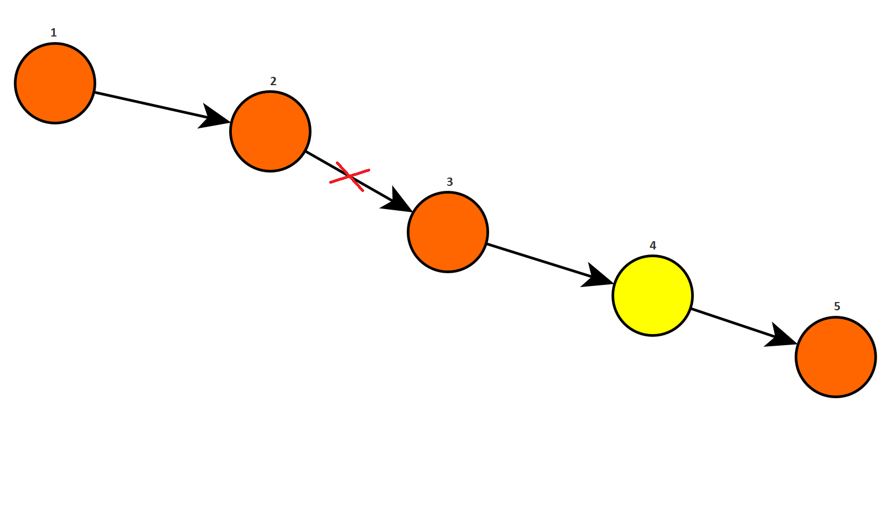
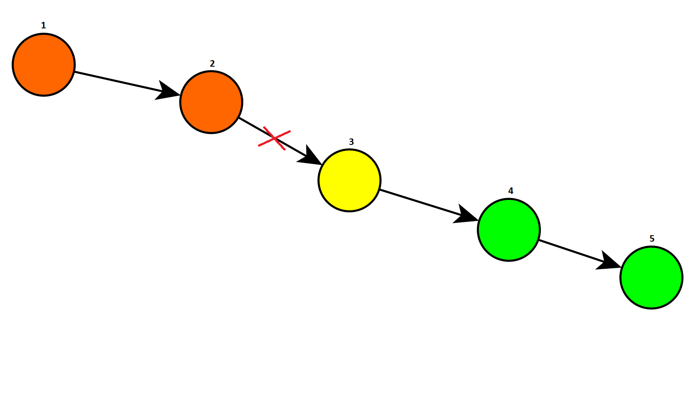

# MDP

<!--In a Markov Decision Process (MDP) we have a complete a priori knowledge of the model, so we know exactly what the model of our system is and we can perfectly know what the states are and therefore at every step... we just, without even interacting with the environment, we just plan ahead what to do.-->

We are given a set of disconnected substations $\mathcal C$, with cardinality $|\mathcal C| = N$ (in practice in Trieste they are always $< 20$), between two remotely controlled substations, where these last will not be included in the problem, since they are already reconnected (in grey in Figure 1.).

We define the cost of the process as the amount of time each underlying user of <!--each user underneath-->each substation remains disconnected. So we compute the cost multiplying the time of disconnection for the number of users of a substation, and we sum them. Our objective is to minimize this cost.

<table>
  <tr>
    <td>
      
    </td>
    <td>
      
    </td>
  </tr>
<tr>
    <td>Figure 1. The fault has just occourred. All the substations are disconnected (orange).</td>
    <td>Figure 2. We visit substation 4 (yellow).</td>
  </tr>
</table>
<table>
  <tr>
    <td>
      
    </td>
    <td>
      
    </td>
  </tr>
<tr>
    <td>Figure 3. We have reconnected substations 4 and 5 (green). We go in substation 3 (yellow).</td>
    <td>Figure 4. We have riconnected substation 3 (green). We are in substation 2 (yellow).</td>
</tr>
</table>
<table>
  <tr><td>
    

</td></tr>
  <tr><td>Figure 5. We reconnected substations 1 and 2 (green). All the subsations are reconnected.</td></tr>
</table>

In this MDP we have that

- the __state__ is $s = (x_g, v_k, \{v\})$, where $x_g$ is the position of the fault, $v_k \in \mathcal C$ is the substation in which the technician is, and $\{v\}$ is the set of the still disconnected substations after the technician operates in the current substation $v_k$. We could also use the substation already reconnected, since they are complementary: given one of the two sets we can always retrieve the other. We have that the variables $v_k$ and $\{v\}$ are **observable**, while the variable $x_g$ is **hidden**.
  When the fault occurs the technician can be everywhere: at home if it is the middle of the night, at the company, be around, etc. So we introduce an extra "fake" substation, called substation $0$, that is the position of the technician when the fault occurs. So the **initial state** is always $s_0 = (x_g, 0, \mathcal C)$.
  Instead, the **terminal state** is of the form $s_t = (x_g, v_k, \varnothing)$, where we have that, if the fault is on a cable, $v_k$ will be one of the two substations at the ends of that faulty cable , so we would have two terminal states, while if the fault is in a substation, $v_k$ would be that exact substation, so the terminal state would be only one.
  So there is an initial cost which has a random component which depends on the position of the technician when the fault occurs. But what is important in our problem, based on how we are dealing with it, is the average cost, so we can think of doing an average with respect to all the possible distributions of the position of the technician, and this gives me a first average cost, which is the idea of the substation $0$. The substation $0$ represents the average position of the technician, so the associated cost to go to one random substation from this position. This is a rather brutal approximation of what happens in reality, but to make it more detailed we should introduce a spatial structure of the problem besides the graph representation..... Giving different costs to go from the substation $0$ to ever other substation introduces a kind of metric <!--[12:30 ???]-->
  
- the **action** is the intervention we do in the specific substation we decide to visit, so $a \in \mathcal C$. Actually, since we visit only disconnected substations, we have that $a \in \{v\}$.

- the **next state** is $s' = (x_g, v_{k+1} = a, \{v'\})$, where is the set of disconnected substations after the technician operates in substation $v_{k+1}$. We have that $\{v'\} \subseteq \{v\} \backslash a$, so the set of disconnected substations decreases after each action. We are therefore positive that the process terminates.

- the **reward** is the *cost* of going in a certain substation (as the time *in seconds* that it takes to go there from where we are) multiplied for the number of disconnected users. Let's define as $d_{v_k, v_{k+1}}$ the time *in seconds* to go from the substation $v_k$ to the next substation $v_{k+1}$, and $n_{k}$ the number of users still disconnected <u>before</u> operating in substation $v_{k+1}$.  So if we are in state $s = (x_g, v_k, \{v\})$, we make an action $a$ and we end up in state $s' = (x_g, v_{k+1} = a, \{v'\})$, we have that the number of disconnected users is $n_{k} = \sum_{v \in \{v\}} u_v$, where $u_v$ is the number of users underneath substation $v$. So the reward depends only on the previous state $s$ and the action taken $a$, and has formula
  $$
  r\Big( s = (x_g, v_k, \{v\}), a, s' = (x_g, v_{k+1} = a, \{v'\}) \Big) = d_{v_k, a} \cdot n_{k} = d_{v_k, a} \cdot \sum_{v \in \{v\}} u_v \,.
  $$
  For now, in the cost we will ignore the cost of discovering if the fault is left or right, which might rise the total cost significantly. This is due to a lack of data. To improve the computation of the cost, we need to  take note carefully of the operations the technicians perform when a fault occurs. This will be done with a Telegram bot (see Section ?).

**Idea for the state:** We could use as state everything that is included in the ordered pair of two substations: $\{v\} = (v_l, v_r)$. And every intervention sends me from one state to another. Topological assumption: we have a tree structure. We have to find a way of representing forks.

**Example 1:** Looking at the Figures 1-5, we have that the sequence of states and actions is:

- $s_0 = (x_g, 0, \mathcal C = \{1,2,3,4,5\}), a = 4$,
- $s_1 = (x_g, 4, \{1,2,3\}), a = 3$,
- $s_2 = (x_g, 3, \{1,2\}), a= 2$,
- $s_3 = (x_g, 2, \varnothing)$.

Since we know every aspect of the problem and we have a model of the environment, this is a **model-based** problem. Besides, this is a problem of **partial observability**, since part of the state $s$ is hidden, which is the position of the fault $x_g$, that we don't know. So, we can not solve it using dynamic programming, because in this way the policy would depend on the whole state, thus also on the hidden state, which can not be.

Actually, if we know where the fault is, the solution is straightforward: if it is on an edge to solve the fault we need to visit the two substations at the ends of it (we might have to choose the right order), if it is in a substation we visit it directly.

Not knowing the position of the fault $x_g$, we can solve this problem with two different approaches. One is to use **approximate value iteration**: we work in a subspace of the states space corresponding to the observable states. Another possibility is to perform **policy iteration**, in particular gradient descent in the policy space. So we impose that the policy depends only on the observable variables, and we try to find the best policy in this subspace in order to optimize the MDP.

The system is **deterministic**, so given an admissible action $a$ we will surely perform it and end up in the state in which that action leads. We can say that there are no execution errors, and I will always do what I want to do. This means that $s' = \sigma(s,a)$. So, mathematically we have that the **transition probability** is
$$
p(s' \mid s, a) = \mathbb I\big(s' = \sigma(s+ a)\big) = \delta_{s', \sigma(s+a)} = \begin{cases} 1 & \text{if } s'=\sigma(s+a) \\ 0 & \text{otherwise} \end{cases} \,,
$$
where $\delta$ is the Kronecker delta and $\mathbb I$ is the characteristic function of a set.
In our specific case, the transition probability is equal to $1$ only when, starting from state $s = (x_g, v_k, \{v\})$, the new substation $v_{k+1}$ of the next state $s' = (x_g, v_{k+1}, \{v'\})$ is equal to the action $a \in \{v\}$ that we took:
$$
p(s' | s,a) = \begin{cases}
1 & \text{if } v_{k+1} = a \\
0 & \text{if } v_{k+1} \neq a
\end{cases} \,.
\label{eq:transprob}
$$
Since we don't know where the failure is, the **policy** depends only on the observable states, so it doesn't know where the fault is. Let's define a parameterized policy using Boltzmann parameterization:
$$
\pi \Big( a \;\big|\; s = (x_g, y=(v_k, \{v\})), \theta \Big) = \frac{e^{\theta_a y}}{\sum_{b \in \mathcal A} e^{\theta_b y}} \,.
\label{eq:parameterizedpolicy}
$$
where $\theta$ are the parameters for each action, so $\theta = (\theta_1, \theta_2, \ldots, \theta_N)$ (where $N$ is the number of substations, so the number of possible actions), which depends only on the observable variable $y$.

If we search in this space of policies, this will give us a policy which doesn't depend on the time, since with any algorithm we try to find the optimal parameters to solve this problem. This gives us a **stationary policy**. The structure of the states is already a measure of time, since we have the number of steps already done: the substations we already visited. So the important is not to establish a policy at the different steps, but a policy with respect to the states.

This is a problem with terminal state, which occurs when we reconnect all the substations. It will always be reached, since with every action we visit a substation, and at the very least we remove it from the set of disconnected substations (instead, if we are lucky, every time we can remove half of the substations from the set of disconnected substations). So, for this specific problem it doesn't make sense to introduce a discount factor $\gamma$.

Let's define $J$ as the sum of all the costs we have if we are in state $s = (x_g, v_k, \{v\})$ summed in time until the process is concluded. The steps of the process are formal steps, since in a step we pass from one substation to another, so the physical time is in the costs (as the time / cost of going from one substation to another).

So we associate a *cost function* $J_\pi$ to each state $s \in \mathcal S$, that is the *accumulated cost from that state to the end of the process, following policy $\pi$*. So we have that the cost is

$$
\begin{aligned}
J_\pi (s) &= \mathbb E_\pi \left[ \sum_{t=0}^\infty r(s_t, a_t, s_{t+1}) \right] \\
&= \mathbb E_\pi \left[ \left. \sum_{k=0}^\infty d_{v_k, a} \cdot n_{k} \;\right|\; s_0 = s \right] \,.
\end{aligned}
$$
If we can find an optimal path in the states, we can find an optimal path in the substations, since that state contains the current substation and other information.

*Can we find a recursive relation like in the Traveling Salesman?* Using the recursive equation of the value function $V$, since $V=J$, we have that
$$
J_\pi \Big( s = (x_g, v_k, \{v\}) \Big) = \sum_{a \in \{v\}} \pi(a | s) \Big[ d_{v_k, a} \cdot n_{k} + J_\pi \Big( s' = (x_g, a, \{v'\}) \Big) \Big].
$$
Since the transition probabilities are deterministic, from each one of the two (or one) terminal states we can go back. But unlike in the Traveling Salesman, we won't solve the Bellman's equation at each step performing a $\max$ on the actions, since the policy can not depends on the whole state, but only on the observable part.

This is why we have to perform a continuous projection in the case of approximate value iteration or the gradient search. The approximate value iteration is a delicate operation and you have to pay a lot of attention, instead using the gradient is more direct. So we will use the latter.

### Gradient descent in the policy space

We have that the gradient formula is
$$
\nabla_\theta J = \sum_{s,a} \eta_\pi(s) Q_\pi(s,a) \nabla_\theta \pi(a|s) \, .
\label{eq:gradient}
$$
To optimize $J$ we perform a gradient descend on $\theta$. The quantities $\eta$ and $Q$, given a policy $\pi$, are computed through *linear* operations (since they obey to linear equations), and are computed for all the states. They don't contain the position of the fault, then we sum over all possible positions of the fault.

**Initial state:** We didn't visit any substation and we have all the possible positions of the fault.

From the theory we have that
$$
\begin{aligned}
Q_\pi(s,a) &= \sum_{s'} p(s' | s,a) \left(r(s,a,s') + \sum_{a'} \pi(a'|s')Q(s',a') \right) \\
&= \mathbb E \left[ \left. \sum_{t=0}^\infty r(s_t,a_t,s_{t+1}) \;\right|\; s_0 = s, a_0 = a \right] \,.
\end{aligned}
\label{eq:Qtheory}
$$
is the **state-action value function** or the **quality** of the state-action pair. Given that the state is $s = (x_g, v_k, \{v\})$, the action is $a \in \{v\}$ and the new state is $s' = \sigma(s,a) = (x_g, v_{k+1}=a, \{v'\})$, the equation of $Q$ in our case, given $\eqref{eq:transprob}$, is:
$$
\begin{aligned}
Q_\pi(s,a) = \left(d_{v_k, a} \cdot n_{k} + \sum_{a' \in \{v'\}} \pi \big( a' | \sigma(s,a) \big) Q \big( (\sigma(s,a), a' \big) \right) \,.
\end{aligned}
$$
While for the other variable we have that
$$
\begin{aligned}
\eta_\pi(s') &:= \rho_0(s') + \sum_{s,a} \pi(a | s) p(s' | s, a) \eta_\pi(s)
\end{aligned}
\label{eq:etatheory}
$$
is **the time spent in state $s'$ before the process dies**, where $\rho_0(s')$ is the probability of starting in the initial state $s'$.

We can notice that the value of $Q$ depends on the values of $Q$ of future states, while the value of $\eta$ depends on the values of $\eta$ for previous states.

In $\eqref{eq:Qtheory}$ we have that for every value of the parameters $\theta$ we know $\pi(a'|s')$, so it is a linear equation in $Q$.

We have that that states are in the order of the number of substations cubed $N^3$, since we have the position of the fault and the two substations that identify the not yet visited substations, and the actions are in the order of $N$. So $Q$ is an equation in $N^4$ variables. We solve it iteratively using value iteration (we find the fixed point).  ==Actually we can compute it in one sweep over all the possible states!==

We can go from any substation to any other substation that has not already been connected. Let's suppose that our policy is simply to go randomly in one of the substations still disconnected, so $\pi$ is a uniform distribution over the disconnected substations, so it is
$$
\pi\Big(a \left| s = (x_g,v_k,\{v\}) \right. \Big) = \frac1{| \{ v \} |}
\label{eq:rndpolicy}
$$
So since $s' = (x_g, v_{k+1}=a, \{v'\})$ we have that $Q$ becomes
$$
\begin{aligned}
Q_\pi\Big( s = (x_g,v_k,\{v\}), a \Big) &= d_{v_k, a} \cdot n_{k+1} + \sum_{a' \in \{v'\}}  \frac1{|\{v'\}|} Q \Big( \sigma(s,a), a' \Big)
\end{aligned}
\label{eq:Q}
$$
*Let's try to estimate how much does it cost computing $Q$.* If we use the QR factorization for rectangular matrices on $Q \in \mathbb R^{|\mathcal S| \times |\mathcal A|}$, is costs $O(|\mathcal S| \times |\mathcal A|^2)$. Since we have that the number of substations is $|\mathcal C| = N$, given that a state can be thought as the current substation $v_{k}$ and the pair of substations that delimit the segment of disconnected substation, we have that $|\mathcal S| \sim O(N \cdot N^2) = O(N^3)$, while $|\mathcal A| \sim O(N)$. So we have that solving this linear system requires $O(|\mathcal S| \times |\mathcal A|^2) = O(N^3 \times N^2) = O(N^5)$.  ==CHECK WHAT PROF SAID ABOUT SPEED==

We have that in $\eqref{eq:eta}$ the function $\rho_0(s')$ is the probability of starting in the initial state $s'$. Since we don't have any prior information of where the fault might be, $\rho_0$ doesn't depend on it, so $\rho_0$ will be uniform in $x_g$. This means that we divide by the number of possible positions of $x_g$, which is either in a substation or in a cable, so it is $N + (N+1) = 2N+1$. Instead, the first substation in which to go is always the fake substation $0$, which represents the position of the technician when the fault occurs, and the set of the disconnected substations must be equal to the set of all the substations $\mathcal C$. So $\rho_0$ must be $1$ when the current substation is $0$ and the set of the disconnected substations is equal to $\mathcal C$, and must be $0$ for every other situation. So we have that
$$
\rho_0 \Big(s = (x_g, v_k, \{v\}) \Big) = \frac1{2|\mathcal C| + 1} \mathbb I \big( v_k=0, \{v\} = \mathcal C \big) = \frac1{2N+1} \mathbb I \big( v_k = 0, \{v\} = \mathcal C \big) \,.
\label{eq:rho}
$$
Actually, according to the technicians of the company, the majority of the faults happen in the cables, usually when they are not anymore perfectly isolated (e.g. the wire's insulation breaks down) and they cause a short circuit, being connected to the ground and allowing charge to flow through it. We will try to take advantage of this information in a later moment, but for now we will suppose that every component has the same probability of being damaged.

So in our case, thanks to $\eqref{eq:rho}$, $\eqref{eq:rndpolicy}$, and $\eqref{eq:transprob}$, we have that
$$
\begin{aligned}
\eta_\pi\Big(s' = (x_g, v_{k+1}, \{v'\}) \Big) &:= \rho_0(s') + \sum_{s,a} \pi(a | s) p(s' | s, a) \eta_\pi(s) \\
&= \frac1{2N+1} \mathbb I \big( v_k = 0, \{v'\} = \mathcal C \big) + \sum_{s \in \mathrm{pa}(s')} \pi(a = v_{k+1} | s) \eta_\pi(s)
 \\
&= \frac1{2N+1} \mathbb I \big( v_k = 0, \{v'\} = \mathcal C \big) + \sum_{s \in \mathrm{pa}(s')} \frac1{|\{v\}|} \eta_\pi \Big( s = (x_g, v_{k}, \{v\}) \Big)
\end{aligned}
\label{eq:eta}
$$
where $\mathrm{pa}(s')$ indicates the parents of the node $s'$ in the dependency graph (probabilistic graphical model - Bayesian Network).

**Idea of the algorithm:** We start from a certain policy, for example the random policy of equation $\eqref{eq:rndpolicy}$, in which we choose randomly the substation to be visited. This means that in the parameterized policy $\eqref{eq:parameterizedpolicy}$ all the parameters $\theta$ are equal to $0$: $\theta = 0 = (0, 0, \ldots, 0)$. This is because in the random policy the parameters $\theta$ don't depend on the action $a$, so we have that
$$
\pi \Big( a \;\big|\; s = (x_g, y=(v_k, \{v\})) \Big) = \frac{e^{\theta y}}{\sum_{b \in \{v\}} e^{\theta y}} = \frac{e^{\theta y}}{e^{\theta y} \sum_{b \in \{v\}} 1 } = \frac1{ |\{v\}| } \, .
\label{eq:policy}
$$
This is true for every choice of $\theta$ which doesn't depend on the action, but in practice to construct a uniform policy we take $\theta = 0 = (0, 0, \ldots, 0)$. But notice that this is not the only way.

In general, there is no guarantee that this is a convex problem in the parameters $\theta$, we could have several different minima. So one should do random restarts with different policies than the random one to see if you can reach a different minimum. However, this doesn't guarantee to find the global minimum, but it is the best we can do.

Then we compute the gradient using $\eqref{eq:gradient}$. The gradients of the policy are simple computations (since we decided the parametrization of the policy, we can derive it), while the objects $Q$ and $\eta$ have to be done indirectly: you have to solve the linear equations $\eqref{eq:Q}$ and $\eqref{eq:eta}$ for that given policy. This can be more or less computationally heavy, but we have to solving two linear equations, with any chosen method. Given the form of our transition probabilities $p(s' | s,a)$, we have that the equations of $Q$ don't depend on $s'$, but only on $a$. So fixed the first state $s$, we have to solve two linear equations only on the actions (we can see the $Q(s,a)$ matrix as a series of vectors). **This operations can be parallelized!**

So having done these steps we have an expression for the gradient for every parameter. So we do a sweep over all the parameters and we find the value of the gradient for each one of them. Then we take a step in the parameters space and we descent the gradient. We stop when the value of $J$ doesn't change "so much" in percentage.

I we have the intuition that there is a deterministic sequence of action to be performed, we have that the parameters $\theta$ tend to infinity. This is because the deterministic policies correspond to a one-hot vector in which we have $1$ for only one action and $0$ for all the other actions, and this happens when the parameter associated to this action becomes much bigger than the others, so that when we normalize it with the parametrization of the policy (which is like a softmax) it becomes $1$ while the others are so small that becomes $0$. If it is like this, the gradient descent never stops and there could be problems of overflow on $\theta$ since it goes to infinity.

A smart thing to do when this happens is to write the parametrization in the following way (the state $s$ is fixed):
$$
\pi(a) = \frac{e^{\theta_a}}{\sum_b e^{\theta_b}} = \frac{e^{-(\max_{a'} \theta_{a'} - \theta_a)}}{\sum_b e^{-(\max_{a'} \theta_{a'} - \theta_b)}} \, .
$$
The benefit of writing it in this way is that, since the exponents of the two exponentials are negative (the parts in the parenthesis ($\max_{a'} \theta_{a'} - \theta_a)$) are always positive), this never explodes. This is a simple numerical trick that allows to improve the stability of the algorithm. ([link](https://eli.thegreenplace.net/2016/the-softmax-function-and-its-derivative/))

#### Automatic computation of $Q$ and $\eta$

The computation of $Q$ and $\eta$ is done for every possible state simultaneously, included all the possible positions of the fault. So they are not quantities that are observable, because they depend on the position of the fault.

The gradient is computed... <!--[18:00 ==???==]--> It is a problem of planning in which the decisions are made based only over a subset of the quantities that define the states. So we have to solve the equations for $Q$ and $\eta$ for every position of the fault $x_g$.

<!--==[31:00]== matrice per ogni posizione del guasto che si scrivene-->

<!--==[35:08]== RIPRENDI-->

We want to find an automatic way to compute the matrix $Q$ and the vector $\eta$. We have that
$$
Q[s,a]  = P[s,a|s',a'] Q[s',a'] + R[s,a]
$$
 where $Q,P$ and $R$ are matrices.

The matrix $R[s,a]$ represents the immediate cost of being in state $s$ and doing action $a$, and it is computed using:
$$
R \Big[ s = (x_g,v_k,\{v\}), a \Big] = d_{v_k,a} \cdot n_k = d_{v_k,a} \cdot \sum_{v \in \{v\}} u_v \,.
$$
For every position of the fault, we compute the matrix $Q$ bottom-up and the vector $\eta$ top-down. We can overwrite these matrices every time since we don't need them for long. <!--[46:00 (?)]-->

### Compute the gradient

$$
\nabla_\theta J = \sum_{s,a} \eta_\pi(s) Q_\pi(s,a) \nabla_\theta \pi(a|s) \, .
\nonumber
$$

Given the equation for the policy in $\eqref{eq:parameterizedpolicy}$, we have that its derivative is
$$
\begin{aligned}
\frac{\partial}{\partial \theta_c} \pi \Big( a \;\big|\; s = (x_g, y=(v_k, \{v\})) \Big) &= \frac{\partial}{\partial \theta_c} \left( \frac{e^{\theta_a y}}{\sum_{b \in |A|} e^{\theta_b y}} \right) \\
&= \frac{\delta_{a,c} \cdot e^{\theta_a y} \cdot y \cdot \sum_{b \in |A|} e^{\theta_b y} -  e^{\theta_a y} \cdot e^{\theta_c y} \cdot y}{(\sum_{b \in |A|} e^{\theta_b y})^2} \\
&= y \left( \frac{\delta_{a,c} \cdot e^{\theta_a y} \cdot \sum_{b \in |A|} e^{\theta_b y}}{(\sum_{b \in |A|} e^{\theta_b y})^2} - \frac{e^{\theta_a y}}{\sum_{b \in |A|} e^{\theta_b y}}\cdot\frac{e^{\theta_c y}}{\sum_{b \in |A|} e^{\theta_b y}} \right) \\
&= y \left( \delta_{a,c} \pi(a) - \pi(a) \pi(c) \right)
\end{aligned}
$$
When $\theta = 0$ we have that
$$
\left. \frac{\partial}{\partial \theta_c} \pi(a) \right|_{\theta=0} = y \left( \frac1{|\{v\}|} \delta_{a,c} - \frac1{|\{v\}|^2} \right)
\label{eq:derivpi}
$$
<!--[38:30] I termini di $Q$ pesando in modo diverso questi valori: le $Q$ più alte prendono un gradiente positivo più alto-->

<!--We compute the term $\eqref{eq:derivpi}$ for each $c \in \mathcal A$, then $\theta_c = \theta_c - \alpha \frac{\delta J}{\delta \theta_c}$.-->

So we have that $\theta = \theta - \alpha \nabla_\theta J$.

### Model free

If this is not possible, one option is to do it model free, so instead of doing a complete gradient we do a stochastic gradient, using the **policy gradient algorithms**. In this case we remove the cost of solving the equations for $Q$ and $\eta$, since we proceed by trial and error, you try an action, compute a policy, upgrade the gradient and go on, and this operations are not computationally heavy: you just need to experience the costs. The downside is that it is stochastic, so it has a great variance.

### Natural policy gradient

Another option that can be done both at the level of the deterministic gradient and at the level of the stochastic gradients is to use **natural policy gradient**. It's a minimal change: we only change the gradient of $\pi$, everything else remains the same.

The improvement is that instead of having a gradient that reaches a horizontal asymptote, the gradient keeps on moving and doesn't slow down. This allows to reach the convergence faster.

